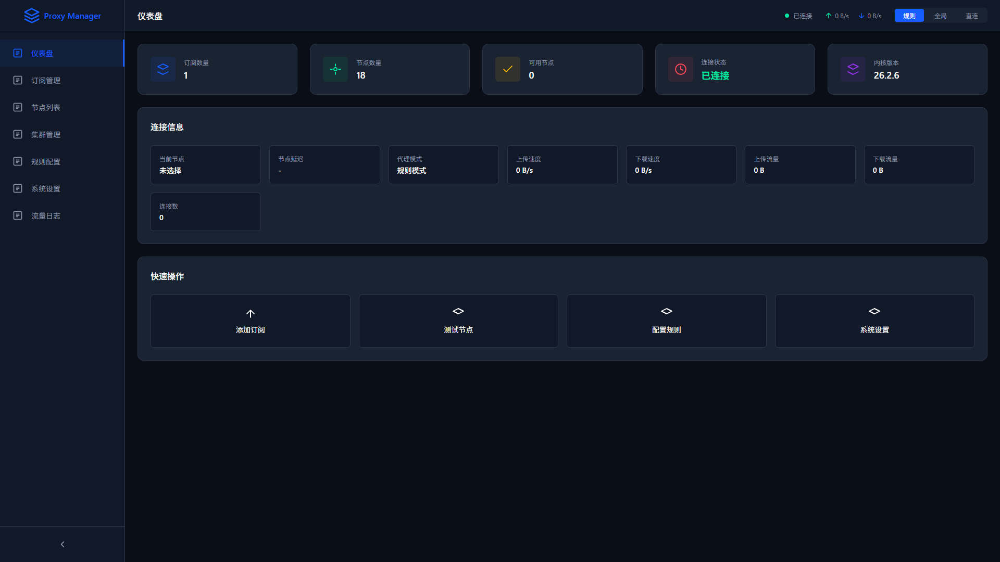
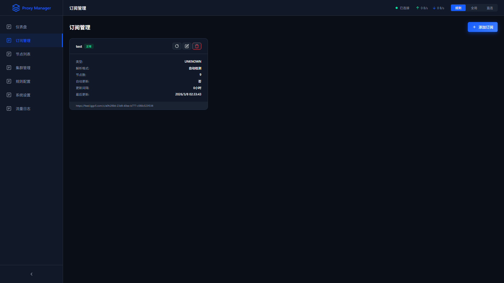
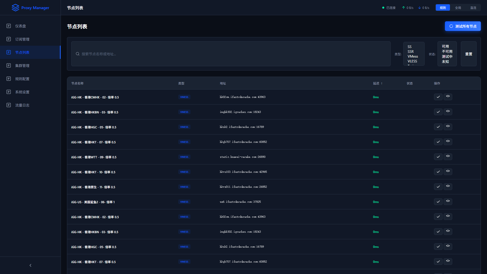
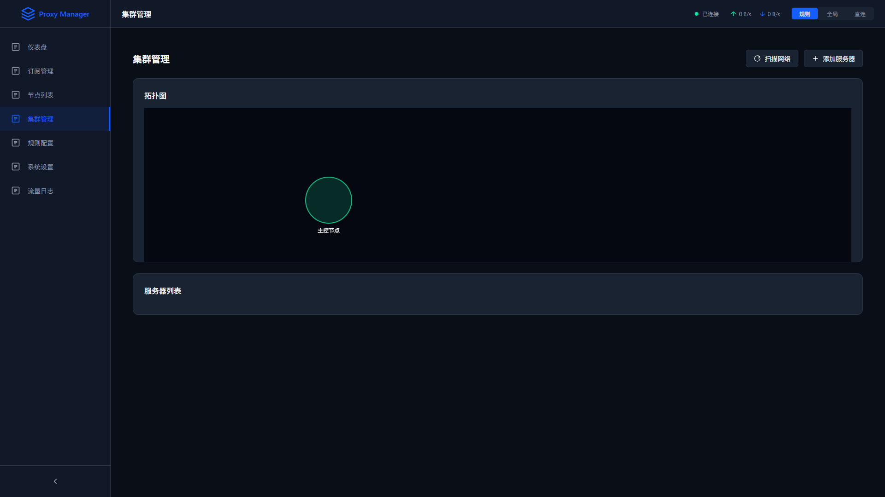
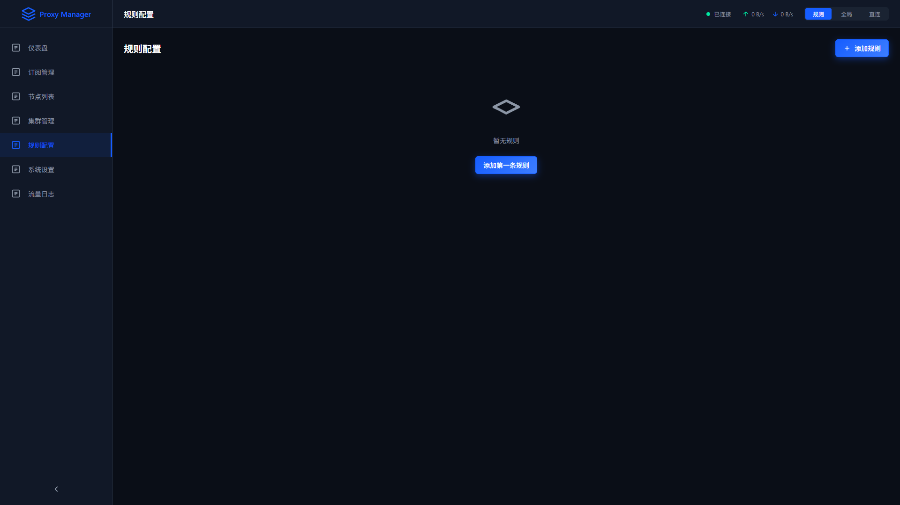
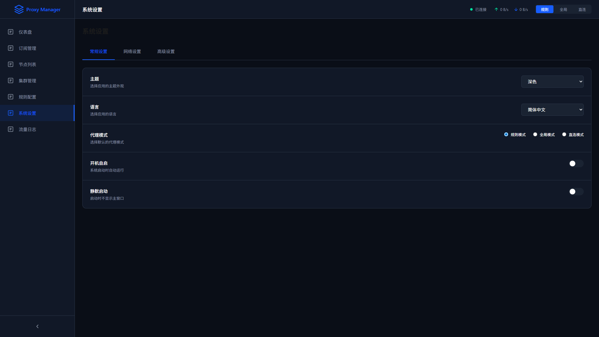
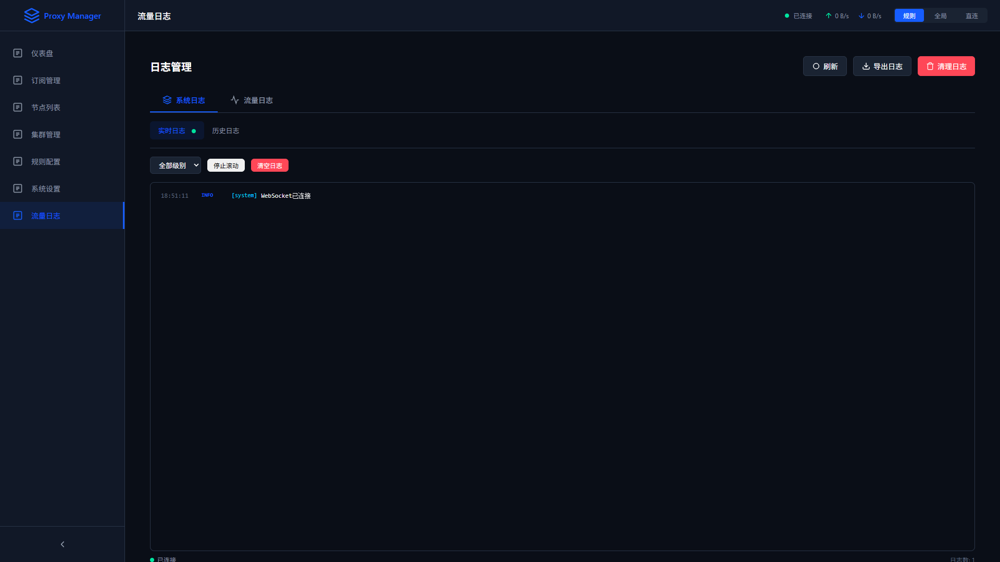

# Proxy Server Web Manager

**作者：Dong hua**

[中文](#中文) | [English](#english)

---

## 中文

### 项目介绍

一款集成服务器代理订阅功能的Web应用程序，设计理念参考Clash客户端，专门适配Web端使用场景。采用前后端分离架构，前端使用Vue 3框架开发用户界面，后端采用Gin框架构建API服务。

### 核心特性

- **订阅管理** - 支持添加、删除、刷新代理订阅链接，自动解析各种格式
- **节点列表** - 展示所有代理节点，支持筛选、排序、延迟测试
- **连接状态监控** - 实时显示当前连接状态、流量统计
- **代理规则配置** - 支持DOMAIN、IP-CIDR、GEOIP等多种规则类型
- **系统设置** - 主题切换（深色/浅色）、语言设置、代理模式配置
- **Xray-core v26.2.6集成** - 完整支持最新版本特性：
  - VLESS协议（REALITY、XHTTP传输层）
  - VMess、Trojan、Shadowsocks协议
  - TLS配置（pinnedPeerCertSha256替代allowInsecure）
  - Finalmask伪装层（XICMP、XDNS等）

### 技术栈

**前端：**
- Vue 3 + Composition API + TypeScript
- Vite构建工具
- Pinia状态管理
- Vue Router路由
- SCSS样式

**后端：**
- Go + Gin框架
- Xray-core进程管理
- JSON数据存储

### 项目结构

```
proxy_server/
├── backend/                 # 后端Gin服务
│   ├── internal/
│   │   ├── config/        # 配置管理
│   │   ├── handler/      # HTTP处理层
│   │   ├── middleware/   # 中间件
│   │   ├── model/        # 数据模型
│   │   ├── repository/   # 数据访问层
│   │   ├── router/       # 路由配置
│   │   ├── service/      # 业务逻辑层
│   │   └── xray/        # Xray-core集成
│   └── pkg/             # 公共工具包
├── frontend/              # 前端Vue项目
│   └── src/
│       ├── api/          # API服务层
│       ├── router/       # 路由配置
│       ├── stores/       # Pinia状态管理
│       ├── styles/       # 全局样式
│       ├── types/        # TypeScript类型
│       └── views/       # 页面视图
└── docker/               # Docker配置
```

### 页面功能介绍

#### 1. 仪表盘 (Dashboard)

**功能说明：**
- 显示系统状态和连接信息
- 实时流量统计和连接状态
- 快速访问常用功能
- 系统资源使用情况

**主要模块：**
- 连接状态卡片
- 流量统计图表
- 系统信息概览
- 快捷操作按钮



#### 2. 订阅管理 (Subscriptions)

**功能说明：**
- 添加、编辑、删除订阅链接
- 手动或自动刷新订阅
- 查看订阅节点数量和状态
- 支持多种订阅格式

**操作功能：**
- 订阅链接管理
- 定时自动刷新
- 节点批量测试
- 订阅分组管理



#### 3. 节点列表 (Nodes)

**功能说明：**
- 展示所有代理节点
- 支持按名称、延迟、类型筛选
- 节点延迟测试
- 一键连接到节点

**节点信息：**
- 节点名称和类型
- 延迟测试结果
- 流量使用情况
- 连接状态



#### 4. 集群管理 (Cluster)

**功能说明：**
- 服务器集群管理
- 代理部署和监控
- 负载均衡配置
- 集群状态查看

**管理功能：**
- 服务器添加和删除
- 批量部署代理
- 集群健康检查
- 资源使用监控



#### 5. 规则配置 (Rules)

**功能说明：**
- 自定义代理规则
- 支持多种规则类型
- 规则优先级调整
- 规则集管理

**规则类型：**
- DOMAIN - 域名规则
- IP-CIDR - IP地址规则
- GEOIP - 地理位置规则
- PROCESS-NAME - 进程名称规则



#### 6. 系统设置 (Settings)

**功能说明：**
- 代理模式配置
- 端口设置
- 主题和语言设置
- 高级选项配置

**设置项：**
- 代理模式（全局/规则/直连）
- 本地端口配置
- 主题切换（深色/浅色）
- 语言设置
- Xray高级配置



#### 7. 流量日志 (Logs)

**功能说明：**
- 实时流量日志
- 请求详情记录
- 日志筛选和搜索
- 流量统计分析

**日志内容：**
- 时间戳
- 客户端IP和端口
- 请求方法和路径
- 响应状态码
- 响应时间
- 流量大小



### 快速开始

#### 本地开发

**前置要求：**
- Node.js 18+
- Go 1.21+
- Xray-core（系统已安装并添加到PATH）

**启动后端：**
```bash
cd backend
go run main.go
```

**启动前端：**
```bash
cd frontend
npm install
npm run dev
```

访问 http://localhost:3000

#### Docker部署

```bash
# 克隆项目
git clone https://github.com/kingoflongevity/proxy_server.git
cd proxy_server

# 构建并运行（使用Dockerfile）
docker build -t proxy-server .
docker run -d -p 3000:3000 -p 8000:8000 --name proxy-server proxy-server
```

或使用docker-compose：

```bash
docker-compose up -d
```

### API端点

| 方法 | 端点 | 描述 |
|------|------|------|
| GET | /api/subscriptions | 获取所有订阅 |
| POST | /api/subscriptions | 创建订阅 |
| POST | /api/subscriptions/:id/refresh | 刷新订阅 |
| GET | /api/nodes | 获取所有节点 |
| POST | /api/nodes/connect | 连接到节点 |
| POST | /api/nodes/disconnect | 断开连接 |
| GET | /api/rules | 获取所有规则 |
| GET | /api/settings | 获取系统设置 |
| PUT | /api/settings | 更新系统设置 |
| GET | /api/status | 获取连接状态 |

### 配置说明

代理默认端口：
- SOCKS5: 127.0.0.1:10808
- HTTP: 127.0.0.1:10809

### 许可证

MIT License

---

## English

### Project Introduction

A web application for proxy server subscription management, designed with reference to Clash clients, specifically adapted for web usage. It adopts a front-end and back-end separated architecture, with Vue 3 for the front-end UI and Gin framework for the back-end API services.

### Core Features

- **Subscription Management** - Add, delete, and refresh proxy subscription links with automatic parsing
- **Node List** - Display all proxy nodes with filtering, sorting, and latency testing
- **Connection Status Monitoring** - Real-time display of connection status and traffic statistics
- **Proxy Rules Configuration** - Support for DOMAIN, IP-CIDR, GEOIP and other rule types
- **System Settings** - Theme switching (dark/light), language settings, proxy mode configuration
- **Xray-core v26.2.6 Integration** - Full support for latest version features:
  - VLESS protocol (REALITY, XHTTP transport)
  - VMess, Trojan, Shadowsocks protocols
  - TLS configuration (pinnedPeerCertSha256 instead of allowInsecure)
  - Finalmask obfuscation (XICMP, XDNS, etc.)

### Tech Stack

**Frontend:**
- Vue 3 + Composition API + TypeScript
- Vite build tool
- Pinia state management
- Vue Router
- SCSS styles

**Backend:**
- Go + Gin framework
- Xray-core process management
- JSON data storage

### Project Structure

```
proxy_server/
├── backend/                 # Backend Gin service
│   ├── internal/
│   │   ├── config/        # Configuration
│   │   ├── handler/       # HTTP handlers
│   │   ├── middleware/    # Middleware
│   │   ├── model/         # Data models
│   │   ├── repository/    # Data access layer
│   │   ├── router/        # Route configuration
│   │   ├── service/       # Business logic
│   │   └── xray/         # Xray-core integration
│   └── pkg/              # Common utilities
├── frontend/              # Frontend Vue project
│   └── src/
│       ├── api/           # API service layer
│       ├── router/        # Route configuration
│       ├── stores/        # Pinia state management
│       ├── styles/        # Global styles
│       ├── types/         # TypeScript types
│       └── views/         # Page views
└── docker/               # Docker configuration
```

### Page Features

#### 1. Dashboard

**Features:**
- System status and connection information
- Real-time traffic statistics
- Quick access to common functions
- System resource usage

**Main Modules:**
- Connection status cards
- Traffic statistics charts
- System information overview
- Quick action buttons


#### 2. Subscriptions

**Features:**
- Add, edit, delete subscription links
- Manual or automatic refresh
- View subscription node count and status
- Support for multiple subscription formats

**Operations:**
- Subscription link management
- Scheduled automatic refresh
- Batch node testing
- Subscription group management


#### 3. Nodes

**Features:**
- Display all proxy nodes
- Filter by name, latency, type
- Node latency testing
- One-click connection

**Node Information:**
- Node name and type
- Latency test results
- Traffic usage
- Connection status


#### 4. Cluster

**Features:**
- Server cluster management
- Proxy deployment and monitoring
- Load balancing configuration
- Cluster status viewing

**Management Functions:**
- Server add and delete
- Batch proxy deployment
- Cluster health check
- Resource usage monitoring


#### 5. Rules

**Features:**
- Custom proxy rules
- Support for multiple rule types
- Rule priority adjustment
- Rule set management

**Rule Types:**
- DOMAIN - Domain rules
- IP-CIDR - IP address rules
- GEOIP - Geolocation rules
- PROCESS-NAME - Process name rules


#### 6. Settings

**Features:**
- Proxy mode configuration
- Port settings
- Theme and language settings
- Advanced options configuration

**Settings:**
- Proxy mode (global/rule/direct)
- Local port configuration
- Theme switching (dark/light)
- Language settings
- Xray advanced configuration


#### 7. Logs

**Features:**
- Real-time traffic logs
- Request detail records
- Log filtering and search
- Traffic statistics analysis

**Log Content:**
- Timestamp
- Client IP and port
- Request method and path
- Response status code
- Response time
- Traffic size


### Quick Start

#### Local Development

**Prerequisites:**
- Node.js 18+
- Go 1.21+
- Xray-core (installed and in PATH)

**Start Backend:**
```bash
cd backend
go run main.go
```

**Start Frontend:**
```bash
cd frontend
npm install
npm run dev
```

Visit http://localhost:3000

#### Docker Deployment

```bash
# Clone project
git clone https://github.com/kingoflongevity/proxy_server.git
cd proxy_server

# Build and run (using Dockerfile)
docker build -t proxy-server .
docker run -d -p 3000:3000 -p 8000:8000 --name proxy-server proxy-server
```

Or use docker-compose:

```bash
docker-compose up -d
```

### API Endpoints

| Method | Endpoint | Description |
|--------|---------|-------------|
| GET | /api/subscriptions | Get all subscriptions |
| POST | /api/subscriptions | Create subscription |
| POST | /api/subscriptions/:id/refresh | Refresh subscription |
| GET | /api/nodes | Get all nodes |
| POST | /api/nodes/connect | Connect to node |
| POST | /api/nodes/disconnect | Disconnect |
| GET | /api/rules | Get all rules |
| GET | /api/settings | Get system settings |
| PUT | /api/settings | Update settings |
| GET | /api/status | Get connection status |

### Configuration

Default proxy ports:
- SOCKS5: 127.0.0.1:10808
- HTTP: 127.0.0.1:10809

### License

MIT License
